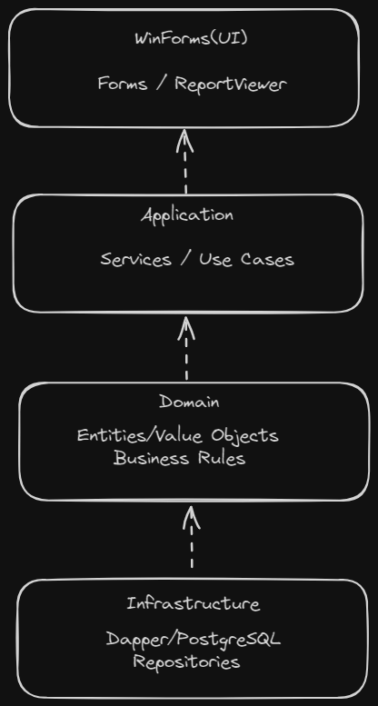

# SalesSystem

Sistema para gerenciamento de **Clientes**, **Produtos** e **Vendas**, desenvolvido com foco em **arquitetura**, **boas práticas** e **qualidade de código**.

---

## Tecnologias

![badge-windows]
![badge-vs-code]
![badge-vs]
![badge-c-sharp]
![badge-dot-net]
![badge-postgre]
![badge-docker]
---

## Arquitetura



* **Clean Architecture** combinada com **Vertical Slice Architecture**
* Separação clara entre:

  * Domain
  * Application
  * Infrastructure
  * WinForms (UI)
* Dependências sempre apontando para abstrações
* Baixo acoplamento e alta coesão

> Não existe projeto sem acoplamento, e sim projetos com bom acoplamento e dependências corretas.

---

## Decisões Técnicas

* **Services ao invés de CQRS**, por não haver necessidade de complexidade adicional
* Uso pontual de **DDD tático** para manter um domínio rico sem rigidez excessiva
* **Injeção de Dependência** em toda a aplicação
* **Dapper parametrizado** para acesso a dados
* Queries centralizadas em classes específicas (`*Queries`)
* Repositórios responsáveis apenas pela orquestração das queries

---

## Banco de Dados

* **PostgreSQL 16**
* Tabelas:

  * clients
  * products
  * sales
  * sale_items
* Chaves primárias, estrangeiras e índices aplicados

Script disponível em:

```text
/scripts/database.sql
```

A string de conexão pode ser configurada no arquivo `appsettings.json`:

```json
{
  "ConnectionStrings": {
    "DefaultConnection": "Host=localhost;Port=5432;Database=sales_system;Username=postgres;Password=postgres"
  }
}
```

---

## Execução

### Banco (Docker)

```bash
docker-compose up -d
```

### Aplicação

1. Executar o script SQL
2. Abrir a solução no Visual Studio
3. Definir **SalesSystem.WinForms** como projeto inicial
4. Executar

---

## Relatórios

* Implementados com **ReportViewer (RDLC)**
* Filtro por período
* Agrupamento por cliente
* Totalização por cliente e total geral
* Dados fornecidos via Application Service

---

## Testes

* Testes unitários (Domain e Application)
* Testes de integração com **Testcontainers**
* PostgreSQL real em container
* Validação de regras de negócio e transações

---

[badge-windows]: https://img.shields.io/badge/Windows-0078D6?style=for-the-badge&logo=windows&logoColor=white
[badge-vs-code]: https://img.shields.io/badge/Visual%20Studio%20Code-0078d7.svg?style=for-the-badge&logo=visual-studio-code&logoColor=white
[badge-dot-net]: https://img.shields.io/badge/.NET-512BD4?logo=dotnet&logoColor=fff&style=for-the-badge
[badge-c-sharp]: https://img.shields.io/badge/c%23-%23239120.svg?style=for-the-badge&logo=csharp&logoColor=white
[badge-postgre]: https://img.shields.io/badge/PostgreSQL-316192?style=for-the-badge&logo=postgresql&logoColor=white
[badge-docker]: https://img.shields.io/badge/Docker-2496ED?logo=docker&logoColor=fff&style=for-the-badge
[badge-vs]: https://img.shields.io/badge/Visual%20Studio-5C2D91.svg?style=for-the-badge&logo=visual-studio&logoColor=white